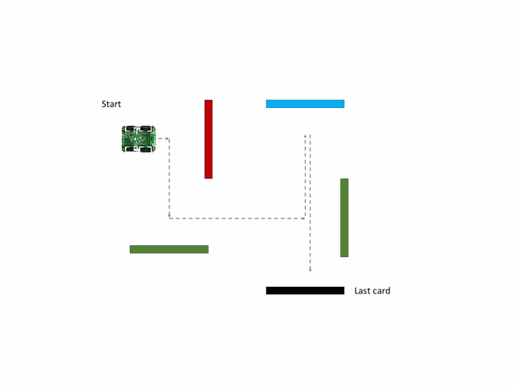

# Tsz & Christian's Final Project - Mine navigation search and rescue

## Table of Contents
- [Objective](#objectives)
- [Video demonstration](#video-demonstration)
- [User inputs and instructions](#user-inputs-and-instructions)
- [Brief overview of code](#brief-overview-of-code)
- [In-depth explanation of code](#in-depth-explanation-of-code)
  * [Clear light interrupt for obstacle detection](#clear-light-interrupt-for-obstacle-detection)
  * [Color recognition and calibration](#color-recognition-and-calibration)
  * [Motor turning](#motor-turning)
  * [Retrace function](#retrace-function)
  * [Serial communication for calibration and debugging](#serial-communication-for-calibration-and-debugging)

## Objectives
To develop an autonomous robot that can navigate a "mine" using a series of instructions coded in coloured cards and return to its starting position. The buggy must satisfy the following performance requirements:

1. Navigate towards a coloured card and stop before impacting the card
1. Read the card colour
1. Interpret the card colour using a predefined code and perform the predefined navigation instruction
1. When the final card is reached, navigate back to the starting position
1. Handle exceptions and return back to the starting position if final card cannot be found

The "mine" is constructed from black plywood walls 100mm high with some walls having coloured cards located on the sides of the maze to assist with navigation. The following colour code is to be used for navigation:

Colour | Instruction
---------|---------
Red | Turn Right 90
Green | Turn Left 90
Blue | Turn 180
Yellow | Reverse 1 square and turn right 90
Pink | Reverse 1 square and turn left 90
Orange | Turn Right 135
Light blue | Turn Left 135 
White | Finish (return home)
Black | Maze wall colour

The following components were used in this autonomous robot:

* PICKTI4: Microcontroller for PIC programmer/debugger
* Clicker 2 for PIC18FJ: Main development board connected to mikroBUS 2 for color recognition
* PIC Buggy: Main body of vehicle integrated with motor control

Code in C was written to [MPLABX](https://www.microchip.com/en-us/development-tools-tools-and-software/mplab-x-ide), and [XC8 Compiler](https://www.microchip.com/en-us/development-tools-tools-and-software/mplab-xc-compilers) was used to compile the code. [Realterm](https://realterm.sourceforge.io/) serial terminal program used to support debugging efforts. [Github](https://github.com/) was used to support version control of the project by managing software development.

The "mines" vary in difficulty, with the simplest requiring four basic moves, and advanced courses requiring up to ten or more moves to navigate. Colors and "mine" configuration is not known in advance. An example "mine" to navigate is shown as follows:

## Video demonstration
View the video demonstration and explanation of the buggy here: 

https://youtu.be/_IlBOZvoGdM

## User inputs and instructions
There are two inputs required by the user: 
* Raw detected RGB values for black and white, respectively W_R, W_G, W_B, B_R, B_G, B_B in main.c
* Clear light threshold interrupt value (in binary) to trigger color recognition in function interrupts_slave_init() in interrupts.c

The buggy can now be run at the start of the maze, just turn it on! 

Note: if debugging is needed, connect the serial port of the buggy to Realterm at 19200 baud. Values of normalised RGB, Hue, Time Forward and Turn will be displayed in that order.

## Brief overview of code
Our code will activate the DC motors to go straight, while incrementing a counter to keep track of how long the buggy is going straight until a clear light threshold interrupt is triggered (ie. the buggy is infront of a card/the wall and light is reflected). If the obstacle is one of the cards with the pre-defined colours, the buggy will execute the desired turn and record it in an array. If the buggy is not in front of a predefined color it will back up, and repeat measurements. Simultaneously, the counter value is added to another array that records the "time" moved forward at every turn. When the final white card is reached, 2 arrays with turns and forward distance data are passed into a retrace function that will make the buggy execute the path to return to the starting position. 

## In-depth explanation of code

### Clear light interrupt for obstacle detection
The color click 2s own interrupt functionality is used to generate an external interrupt on the clicker 2 board. An interrupt is triggered when the clear light value falls outside of a calibrated, predefined range (ie 1800-0). A suitable value had to be chosen, as a overtly low interrupt threshold would lead to false readings in ambient light conditions, while a overtly high interrupt threshold would cause cards to not be detected.

Given that the interrupt pin on the color click goes low when triggered, the extenral interrupt pin on the clicker 2 board is falling edge triggered. Both, the interrupt on the clicker 2 board (INT1) and the interrupt on the color click are cleared after the interrupt subroutine has performed its task. In the interrupt subroutine the "check" flag is set high to cause the code in main.c to eneter a while loop that executes the required turn and memory storage or tries to measure again when no color was recognized. The check flag is cleared when this task is completed in main.c.

### Color recognition and calibration
The colour click 2 board contains a tri-colour LED as an illumination source and a 4 channel RGBC photodiode sensor, which enables measurements of reflected color of nearby objects to be made. The TCS3471 color light-to-digital converter then subsequently generates current when light falls on photodiodes, converting the signal with integrators to generate RGBC (Red, Blue, Green, Clear light) channel values into individual 16-bit digital values. 

Although the individual channel value magnitudes correlate with the amount of corresponding colors detected, their values are not calibrated and normalised with the other channels (e.g. A 500 reading in Red and Green channel does not indicate equal magnitudes of Red and Green are present). For calibrating these values, the raw RGB values of the Black and White sheets were measured at the clear light interrupt threshold as benchmarks for conversion to the standardised [RGB color model](https://en.wikipedia.org/wiki/RGB_color_model), where RGB values range from (0,0,0) for black to (255,255,255) for white. For example, at a predefined threshold of 1500 clear light, white may have RGB values of (722,445,332) and black may have RGB values of (474,274,197). With such values, the measured RGB values can be calibrated via linear interpolation to black and white values, resulting in standardised RGB values that can be extracted and interpreted.

To further distinguish the colors, we initially attempted measuring ratios and ranges for RGB values with different color cards with multiple data points, which was unsuccessful due to overlapping irregularities and no distingushable patterns observed. To mitigate these issues, the additional variable [Hue](https://en.wikipedia.org/wiki/Hue) was introduced. Hue can typically be represented quantitatively by a single number between 0 and 360, often corresponding to an angular position around a central or neutral point or axis on a color space coordinate diagram (such as a chromaticity diagram) or color wheel as shown below:

The hue values were obtained with the following functions from the standardised RGB color code values:

These values allow us to distinguish color ranges, and combined with ranges for standardised RGB values, the individual color sheets can be identified with relative accuracy.
To calibrate the buggy's color recognition, only the values measured by the sensors for black and white are recorded using realterm and added to the relevant define statements in the main.c file. When measuring those calibration values, cards are held at the distance above which the clear light interrupt is triggered. White and Black as RGB (255,255,255) and (0,0,0) respectively are then used to interpolate within the range of RGB colors and obtain the calbrated rgb values for each color from which the hue values are then found. 

### Motor turning
Motor turning was calibrated by trial and error on the operational surface. Due to different surfaces having different friction coefficients, an accurate turning and navigation system that applies to all surfaces cannot be implmenting complex control systems outside the scope of this project.

### Retrace function
The retrace function is used to navigate the buggy back to its original position after encountering a white card. This function utilizes the turns and forward distance data in seperate arrays, and executes the corresponding reverse navigation process by executing the opposite turns counting down from reverse in the arrays. Additionally, since the buggy reverses from the measurement point for a short specific distance , this introduces disrepancies in the forward array, which was mitigated by subtracting the corresponding distance from all measurements.

### Serial communication for calibration and debugging
The serial communication code from the Serial Commuincation lab was used for transmitting data to the serial terminal Realterm on the computer. This was useful for debugging purposes, as it allowed us to access the internal values for recorded RGBC numbers, normalised RGBC values, hue values, and forward/turn arrays.

# Thanks for reading this, hope you enjoyed :)

